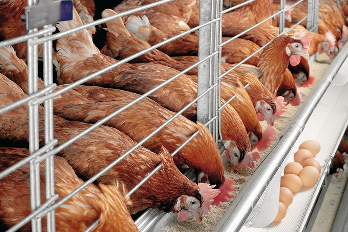

[comment]: # "This is the standard layout for the project, but you can clean this and use your own template"

# Poultry Feed Efficiency Tracking System

---

[comment]: #This is a sample image, to show how to add images to your page. To learn more options, please refer [this](https://projects.ce.pdn.ac.lk/docs/faq/how-to-add-an-image/)

## Team
-  E/18/180, Nimnad Mihiranga, e18180@eng.pdn.ac.lk
-  E/18/266, Nisala Induwara, e18266@eng.pdn.ac.lk
-  E/18/397, Shamod Geevinda, e18397@eng.pdn.ac.lk

## Table of Contents
1. [Introduction](#introduction)
2. [Other Sub Topics](#other-sub-topics)
3. [Links](#links)

---

## Introduction

 Poultry industry is one of the fastest growing industries in Sri lanka. Farmers from every side in the country engage with this industry. But we can see they have been faced to a problem when finding a way to feed the animals efficiently. This can happen because of communication problems and lack of knowledge. So  we are trying to develop a mobile application to avoid that problem. This application will include the main three languages which are used in Sri lanka. Through this application we hope give good guidance and needed details to the farmers.

## Other Sub Topics

.....

## Links

- [Project Repository](https://github.com/cepdnaclk/{{ page.repository-name }}){:target="_blank"}
- [Project Page](https://cepdnaclk.github.io/{{ page.repository-name}}){:target="_blank"}
- [Department of Computer Engineering](http://www.ce.pdn.ac.lk/)
- [University of Peradeniya](https://eng.pdn.ac.lk/)

[//]: # (Please refer this to learn more about Markdown syntax)
[//]: # (https://github.com/adam-p/markdown-here/wiki/Markdown-Cheatsheet)
